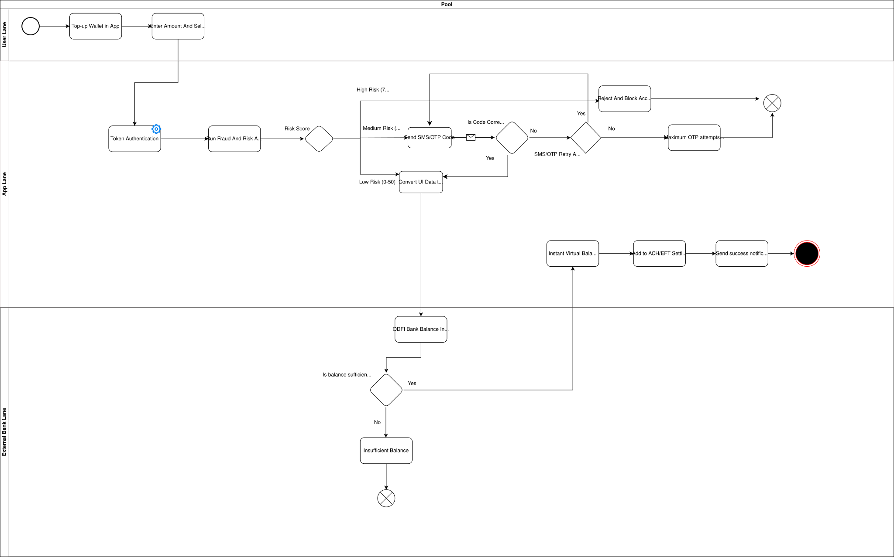
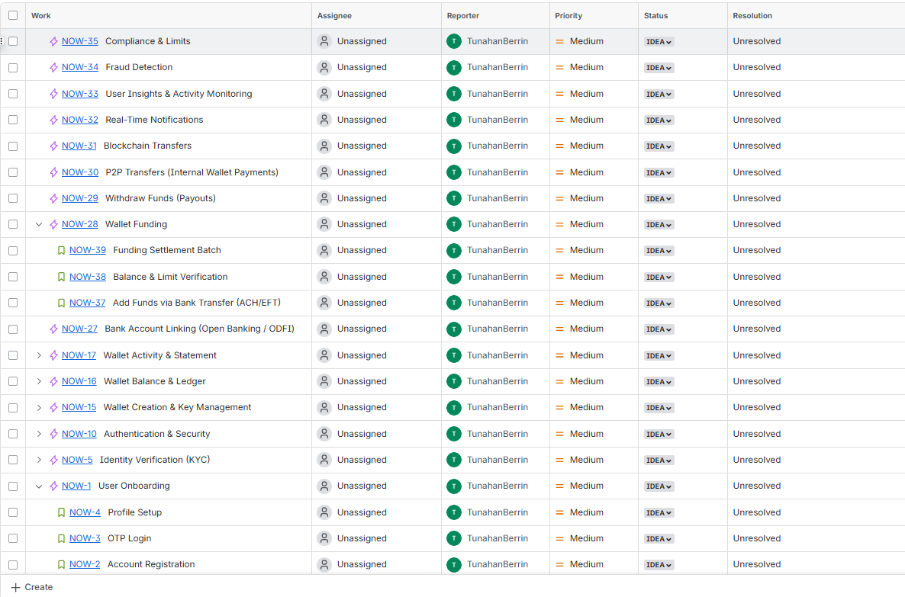
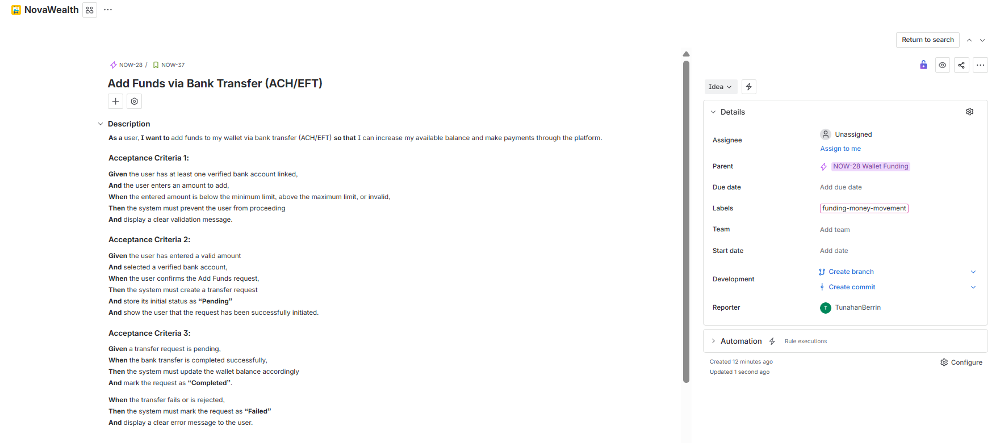

# NovaWealth: Payment Systems & Digital Wallet Orchestration 🚀

**NovaWealth** is a mobile banking and payment platform designed to combine different financial services into one ecosystem. This project is a practical application of the concepts I learned from my specializations:

* **FinTech: Foundations, Payments, and Regulations** – University of Pennsylvania
* **The Future of Payment Technologies** – University of Michigan

## 🏗️ Architectural Overview & Scope
The project covers the two main parts of the payment lifecycle: **Inflow (Funding)** and **Outflow (Processing)**. I followed global standards such as **PCI-DSS, ISO 8583, and EMV 3D Secure 2.0**.

### 1. Digital Wallet & Funding Infrastructure (Inflow)
This section focuses on moving funds from external bank accounts into the NovaWealth wallet safely.
* **Bank Transfers:** I managed the workflows for linking bank accounts and processing ACH/EFT settlement batches.
* **Risk Scoring:** The system runs a "Fraud and Risk Analysis" to give each transaction a risk score (Low, Medium, or High).
* **User Authentication:** Depending on the risk, the system uses Token Authentication or SMS/OTP codes to verify the user.
  

  
🔍 Click to view the Smart Wallet BPMN Flow & Jira Boards

  
  **Smart Wallet Architecture (BPMN 2.0):**
  
   
  
  **User Story Samples:**
  
   
  

### 2. Payment Lifecycle & Gateway Operations (Outflow)
This part manages how a payment moves from the merchant to the final bank approval.
* **Tokenization:** I designed the flow where the "Tokenization Service" converts sensitive card data (PAN) into secure tokens for PCI-DSS compliance.
  

  
🔍 Click to view the Tokenization Workflow

  
  .png)

* **3D Secure 2.0 (RBA):** The system uses Risk-Based Authentication (RBA) and ACS (Access Control Server) cycles to provide a smooth user experience.
   

  
🔍 Click to view the 3D Secure 2.0 Architecture

  
  
  

* **The Authorization Loop:** I mapped the message routing between the Merchant, Gateway, Acquirer, Card Scheme, and Issuer using ISO 8583 standards.
  

  
🔍 Click to view the Authorization Routing

  
  
  

  
* **Clearing & Settlement:** The flow includes calculating Interchange Fees and the Merchant Discount Rate (MDR) before the final fund transfer.
  

  
🔍 Click to view the Capture & Settlement Flow

  
  
  

  
* **Exception Handling:** I detailed the processes for **Void** (canceling a transaction) and **Refund** (returning money) to keep the balance correct.
  

  
🔍 Click to view the Void & Refund BPMN Workflow

  
  

### 3. A2A Transfers & Local Payments
This section focuses on instant account-to-account money movements and alias-based routing.
* **FAST Integration:** I modeled the workflows for instant local payment rails, including timeout and error handling mechanisms.
* **KOLAS (Kolay Adres):** I mapped the processes for resolving user aliases (like phone numbers or emails) into valid IBANs for seamless transfers.
  

  
🔍 Click to view the FAST Error Handling & KOLAS Resolution Flow

  
  
  

  
*   **Open Banking Compliance:** The architecture incorporates PSD2 concepts for secure account linking and data sharing.

### 4. Financial Messaging & Reconciliation
This part manages the end-of-day mathematical validation between internal ledgers and external bank statements.
*   **MT940 Processing:** I mapped the workflows for parsing MT940 electronic bank statements to ensure standardized data ingestion.
*   **EOD Reconciliation:** The system matches external bank records against internal transaction logs to identify exceptions, staging errors, and resolve discrepancies via suspense accounts.
  

  
🔍 Click to view the MT940 Reconciliation Decision Engine

  
  MT940%20_Reconciliation_Process.svg)
  

  
### 5. Data Analytics & SQL (Submodule)
This section focuses on the database logic and analytics required to maintain a healthy payment ecosystem.
*   **Fraud Detection:** I wrote basic to advanced SQL queries using CTEs and Window Functions to flag anomalous transaction velocities and detect double-spending.
*   **Data Hygiene:** I handled data cleaning and duplicate record resolution to ensure accurate financial reporting.
*   **Risk Segmentation:** The queries segment user risk profiles based on KYC status and monitor high-value transaction failures.

---

## 🛠️ Methodology & Tools
*   **Process Modeling:** BPMN 2.0, Draw.io

*   **Product Management:** Jira, Agile/Scrum, Gherkin Syntax (BDD)

*   **Data Analytics:** SQL (DML, DDL, CTEs, Window Functions)

*   **Domain Knowledge:** Open Banking, PCI-DSS, ISO 8583 / ISO 20022 principles, MT940 Reconciliation

